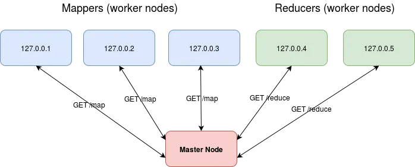

# MapReduce

Not to be confused with JavaScript's `map()` and `reduce()` functions, although they can be used! 😉

A simplified implementation of [MapReduce](https://en.wikipedia.org/wiki/MapReduce), a distributed model [created by Google](https://research.google.com/archive/mapreduce-osdi04.pdf).

Most engineers will use a library implementation, like **Hadoop** by Apache, or grouping in **CouchDB**, and need only concern themselves with the input and output.

## Uses

- You have **too much data for a single server** to compute. For example, **word frequency** to index (sort) billions of web pages.
- So, you have to horizontally scale using a **cluster** of thousands of servers connected by a high-bandwidth connection like ethernet, to run computations in parallel in the course of half an hour.
- **Master nodes** are a central controller that assigns work to worker nodes and aggregates the results.
- **Worker nodes** do the computing.

## Steps

- **Split** splits the input, usually **documents**, into ~64 MB chunks or equal to the number of worker nodes available.
- **Map** executes a map function (eg. word count) across all workers in parallel, and emits intermediate **key-value pairs**.
- **Shuffle** shuffles the output into tasks for the next step. For example, converting map's row-based to reduce's column-based.
- **Reduce** executes a reduce function (eg. sum all counts for a word into an atomic value) across all workers in parallel.

### Example




```js
// Input
"hello hello hello hello world world hello world"

// Split step
{
  "127.0.0.1": "hello hello hello",
  "127.0.0.2": "hello world world",
  "127.0.0.3": "hello world"
}

// Map step
{
  "127.0.0.1": {
    "hello": 3
  },
  "127.0.0.2": {
    "hello": 1,
    "world": 2,
  },
  "127.0.0.3": {
    "hello": 1,
    "world": 1,
  }
}

// Shuffle step
{
  "127.0.0.5": {
    "hello": [3, 1, 1]
  },
  "127.0.0.6": {
    "world": [2, 1]
  }
}

// Reduce step
{
  "127.0.0.5": {
    "hello": 5
  },
  "127.0.0.6": {
    "world": 3
  }
}

// Output
{
  "hello": 5,
  "world": 3
}
```

## Distribution and reliability

- To account for **fault tolerance**, functions must be **idempotent** - the output doesn't change when the function needs to run again when a server crashes.

## Improvements

- Ideally, there is **no data movement**, since network bandwidth is a scarce resource. Send the map functions to the data if possible.
- Otherwise, don't send data via **HTTP** body, but transmit distributed file storage links, or use faster protocols like **gRPC**.
- Don't shuffle on the master node, but distribute it to the worker nodes.
- Stream the data from map nodes to reduce nodes, instead of waiting for all map jobs to finish.
- Use Golang, or another programming language designed for backend performance.

## Resources
- Medium article: https://medium.com/digitalwing/development-of-a-distributed-computing-system-based-on-mapreduce-and-kubernetes-837fc7f112f9

## How To Run

```bash
docker build -t maxproske/mapreduce:latest .

docker push maxproske/mapreduce:latest

kubectl apply -f config.yaml

curl "http://localhost:3000/compute?text=one+fish+two+fish+red+fish+blue+fish"
# {"one":1,"red":1,"fish":4,"blue":1,"two":1}
```
